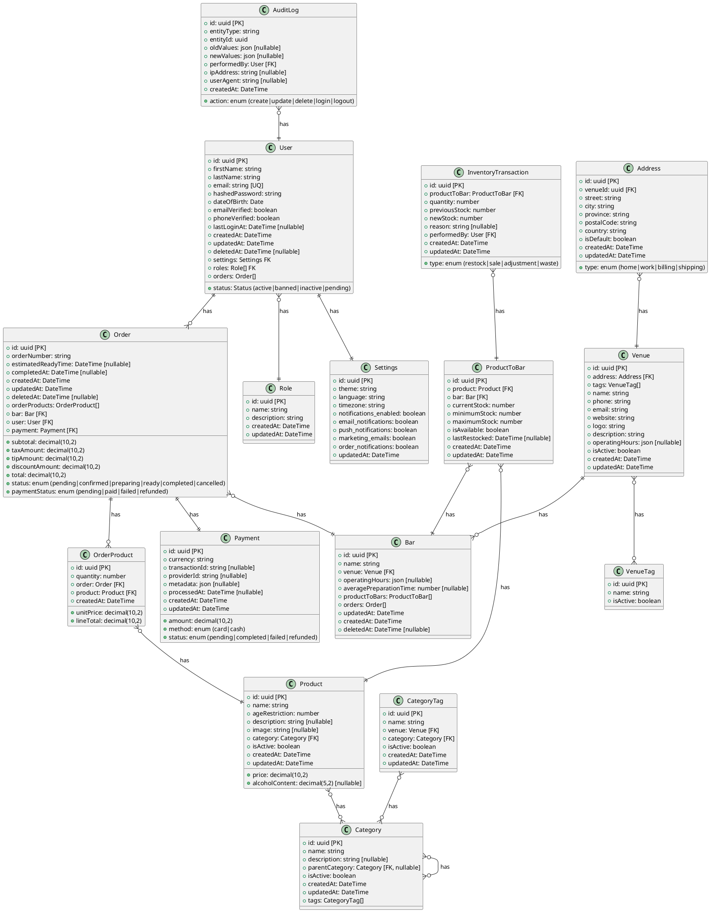

```plantuml
@startuml

' User Entity
class User {
  + id: uuid [PK]
  + firstName: string
  + lastName: string
  + email: string [UQ]
  + hashedPassword: string
  + dateOfBirth: Date
  + status: Status (active|banned|inactive|pending)
  + emailVerified: boolean
  + phoneVerified: boolean
  + lastLoginAt: DateTime [nullable]
  + createdAt: DateTime
  + updatedAt: DateTime
  + deletedAt: DateTime [nullable]
  + settings: Settings FK
  + roles: Role[] FK
  + orders: Order[]
}

' Settings Entity
class Settings {
  + id: uuid [PK]
  + theme: string
  + language: string
  + timezone: string
  + notifications_enabled: boolean
  + email_notifications: boolean
  + push_notifications: boolean
  + marketing_emails: boolean
  + order_notifications: boolean
  + updatedAt: DateTime
}

' Role Entity
class Role {
  + id: uuid [PK]
  + name: string
  + description: string
  + createdAt: DateTime
  + updatedAt: DateTime
}

' Address Entity
class Address {
  + id: uuid [PK]
  + venueId: uuid [FK]
  + street: string
  + city: string
  + province: string
  + postalCode: string
  + country: string
  + type: enum (home|work|billing|shipping)
  + isDefault: boolean
  + createdAt: DateTime
  + updatedAt: DateTime
}

' Venue Entity
class Venue {
  + id: uuid [PK]
  + address: Address [FK]
  + tags: VenueTag[]
  + name: string
  + phone: string
  + email: string
  + website: string
  + logo: string
  + description: string
  + operatingHours: json [nullable]
  + isActive: boolean
  + createdAt: DateTime
  + updatedAt: DateTime
}

class ProductToBar {
  + id: uuid [PK]
  + product: Product [FK]
  + bar: Bar [FK]
  + currentStock: number
  + minimumStock: number
  + maximumStock: number
  + isAvailable: boolean
  + lastRestocked: DateTime [nullable]
  + createdAt: DateTime
  + updatedAt: DateTime
}

class Product {
  + id: uuid [PK]
  + name: string
  + price: decimal(10,2)
  + ageRestriction: number
  + description: string [nullable]
  + image: string [nullable]
  + category: Category [FK]
  + isActive: boolean
  + alcoholContent: decimal(5,2) [nullable]
  + createdAt: DateTime
  + updatedAt: DateTime
}

' Category Entity
class Category {
  + id: uuid [PK]
  + name: string
  + description: string [nullable]
  + parentCategory: Category [FK, nullable]
  + isActive: boolean
  + createdAt: DateTime
  + updatedAt: DateTime
  + tags: CategoryTag[]
}

class OrderProduct {
  + id: uuid [PK]
  + quantity: number
  + unitPrice: decimal(10,2)
  + lineTotal: decimal(10,2)
  + order: Order [FK]
  + product: Product [FK]
  + createdAt: DateTime
}

class Order {
  + id: uuid [PK]
  + orderNumber: string
  + subtotal: decimal(10,2)
  + taxAmount: decimal(10,2)
  + tipAmount: decimal(10,2)
  + discountAmount: decimal(10,2)
  + total: decimal(10,2)
  + status: enum (pending|confirmed|preparing|ready|completed|cancelled)
  + paymentStatus: enum (pending|paid|failed|refunded)
  + estimatedReadyTime: DateTime [nullable]
  + completedAt: DateTime [nullable]
  + createdAt: DateTime
  + updatedAt: DateTime
  + deletedAt: DateTime [nullable]
  + orderProducts: OrderProduct[]
  + bar: Bar [FK]
  + user: User [FK]
  + payment: Payment [FK]
}

' Payment Entity
class Payment {
  + id: uuid [PK]
  + amount: decimal(10,2)
  + currency: string
  + method: enum (card|cash)
  + status: enum (pending|completed|failed|refunded)
  + transactionId: string [nullable]
  + providerId: string [nullable]
  + metadata: json [nullable]
  + processedAt: DateTime [nullable]
  + createdAt: DateTime
  + updatedAt: DateTime
}

class Bar {
  + id: uuid [PK]
  + name: string
  + venue: Venue [FK]
  + operatingHours: json [nullable]
  + averagePreparationTime: number [nullable]
  + productToBars: ProductToBar[]
  + orders: Order[]
  + updatedAt: DateTime
  + createdAt: DateTime
  + deletedAt: DateTime [nullable]
}

' Inventory Transaction Entity
class InventoryTransaction {
  + id: uuid [PK]
  + productToBar: ProductToBar [FK]
  + type: enum (restock|sale|adjustment|waste)
  + quantity: number
  + previousStock: number
  + newStock: number
  + reason: string [nullable]
  + performedBy: User [FK]
  + createdAt: DateTime
  + updatedAt: DateTime
}

' Audit Log Entity
class AuditLog {
  + id: uuid [PK]
  + entityType: string
  + entityId: uuid
  + action: enum (create|update|delete|login|logout)
  + oldValues: json [nullable]
  + newValues: json [nullable]
  + performedBy: User [FK]
  + ipAddress: string [nullable]
  + userAgent: string [nullable]
  + createdAt: DateTime
}

' Category Tag Entity
class CategoryTag {
  + id: uuid [PK]
  + name: string
  + venue: Venue [FK]
  + category: Category [FK]
  + isActive: boolean
  + createdAt: DateTime
  + updatedAt: DateTime
}

class VenueTag {
  + id: uuid [PK]
  + name: string
  + isActive: boolean
}

' Relationships
User }o--|| Role : has
User ||--|| Settings : has
User ||--o{ Order : has
Order ||--o{ OrderProduct : has
Order }o--|| Bar : has
ProductToBar }o--|| Bar : has
ProductToBar }o--|| Product : has
Venue ||--o{ Bar : has
OrderProduct }o--|| Product : has
Order ||--|| Payment : has
InventoryTransaction }o--|| ProductToBar : has
AuditLog }o--|| User : has
Address }o--|| Venue : has
Product }o--o{ Category : has
Category }o--o{ Category : has
Venue }o--o{ VenueTag : has
CategoryTag }o--o{ Category : has


@enduml
```
