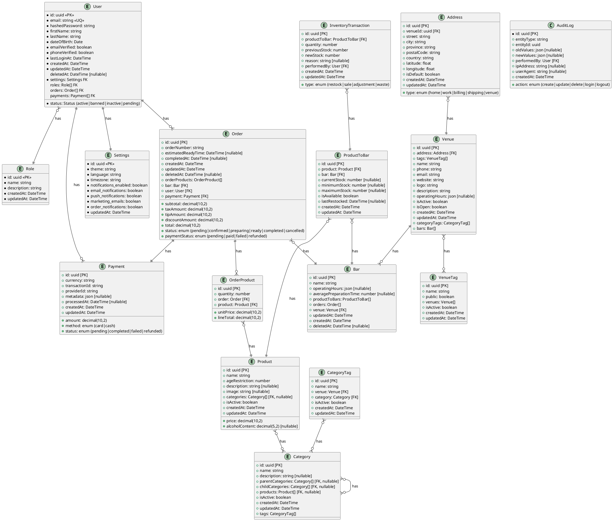

```plantuml
@startuml

entity User {
  *id: uuid <<PK>>
  *email: string <<UQ>>
  *hashedPassword: string
  *firstName: string
  *lastName: string
  *dateOfBirth: Date
  *status: Status (active|banned|inactive|pending)
  *emailVerified: boolean
  *phoneVerified: boolean
  *lastLoginAt: DateTime
  *createdAt: DateTime
  *updatedAt: DateTime
  deletedAt: DateTime [nullable]
  *settings: Settings FK
  roles: Role[] FK
  orders: Order[] FK
  payments: Payment[] FK
}

entity Settings {
  *id: uuid <<PK>>
  *theme: string
  *language: string
  *timezone: string
  *notifications_enabled: boolean
  *email_notifications: boolean
  *push_notifications: boolean
  *marketing_emails: boolean
  *order_notifications: boolean
  *updatedAt: DateTime
}

entity Role {
  *id: uuid <<PK>>
  *name: string
  *description: string
  *createdAt: DateTime
  *updatedAt: DateTime
}

entity Address {
  + id: uuid [PK]
  + venueId: uuid [FK]
  + street: string
  + city: string
  + province: string
  + postalCode: string
  + country: string
  + latitude: float
  + longitude: float
  + type: enum (home|work|billing|shipping|venue)
  + isDefault: boolean
  + createdAt: DateTime
  + updatedAt: DateTime
}

entity Venue {
  + id: uuid [PK]
  + address: Address [FK]
  + tags: VenueTag[]
  + name: string
  + phone: string
  + email: string
  + website: string
  + logo: string
  + description: string
  + operatingHours: json [nullable]
  + isActive: boolean
  + isOpen: boolean
  + createdAt: DateTime
  + updatedAt: DateTime
  + categoryTags: CategoryTag[]
  + bars: Bar[]
}

entity ProductToBar {
  + id: uuid [PK]
  + product: Product [FK]
  + bar: Bar [FK]
  + currentStock: number [nullable]
  + minimumStock: number [nullable]
  + maximumStock: number [nullable]
  + isAvailable: boolean
  + lastRestocked: DateTime [nullable]
  + createdAt: DateTime
  + updatedAt: DateTime
}

entity Product {
  + id: uuid [PK]
  + name: string
  + price: decimal(10,2)
  + ageRestriction: number
  + description: string [nullable]
  + image: string [nullable]
  + categories: Category[] [FK, nullable]
  + isActive: boolean
  + alcoholContent: decimal(5,2) [nullable]
  + createdAt: DateTime
  + updatedAt: DateTime
}

entity Category {
  + id: uuid [PK]
  + name: string
  + description: string [nullable]
  + parentCategories: Category[] [FK, nullable]
  + childCategories: Category[] [FK, nullable]
  + products: Product[] [FK, nullable]
  + isActive: boolean
  + createdAt: DateTime
  + updatedAt: DateTime
  + tags: CategoryTag[]
}

entity OrderProduct {
  + id: uuid [PK]
  + quantity: number
  + unitPrice: decimal(10,2)
  + lineTotal: decimal(10,2)
  + order: Order [FK]
  + product: Product [FK]
}

entity Order {
  + id: uuid [PK]
  + orderNumber: string
  + subtotal: decimal(10,2)
  + taxAmount: decimal(10,2)
  + tipAmount: decimal(10,2)
  + discountAmount: decimal(10,2)
  + total: decimal(10,2)
  + status: enum (pending|confirmed|preparing|ready|completed|cancelled)
  + paymentStatus: enum (pending|paid|failed|refunded)
  + estimatedReadyTime: DateTime [nullable]
  + completedAt: DateTime [nullable]
  + createdAt: DateTime
  + updatedAt: DateTime
  + deletedAt: DateTime [nullable]
  + orderProducts: OrderProduct[]
  + bar: Bar [FK]
  + user: User [FK]
  + payment: Payment [FK]
}

entity Payment {
  + id: uuid [PK]
  + amount: decimal(10,2)
  + currency: string
  + method: enum (card|cash)
  + status: enum (pending|completed|failed|refunded)
  + transactionId: string
  + providerId: string
  + metadata: json [nullable]
  + processedAt: DateTime [nullable]
  + createdAt: DateTime
  + updatedAt: DateTime
}

entity Bar {
  + id: uuid [PK]
  + name: string
  + operatingHours: json [nullable]
  + averagePreparationTime: number [nullable]
  + productToBars: ProductToBar[]
  + orders: Order[]
  + venue: Venue [FK]
  + updatedAt: DateTime
  + createdAt: DateTime
  + deletedAt: DateTime [nullable]
}

entity InventoryTransaction {
  + id: uuid [PK]
  + productToBar: ProductToBar [FK]
  + type: enum (restock|sale|adjustment|waste)
  + quantity: number
  + previousStock: number
  + newStock: number
  + reason: string [nullable]
  + performedBy: User [FK]
  + createdAt: DateTime
  + updatedAt: DateTime
}

class AuditLog {
  *id: uuid [PK]
  + entityType: string
  + entityId: uuid
  + action: enum (create|update|delete|login|logout)
  + oldValues: json [nullable]
  + newValues: json [nullable]
  + performedBy: User [FK]
  + ipAddress: string [nullable]
  + userAgent: string [nullable]
  + createdAt: DateTime
}

entity CategoryTag {
  + id: uuid [PK]
  + name: string
  + venue: Venue [FK]
  + category: Category [FK]
  + isActive: boolean
  + createdAt: DateTime
  + updatedAt: DateTime
}

entity VenueTag {
  + id: uuid [PK]
  + name: string
  + public: boolean
  + venues: Venue[]
  + isActive: boolean
  + createdAt: DateTime
  + updatedAt: DateTime
}

User }o--|| Role : has
User ||--|| Settings : has
User ||--o{ Order : has
Order ||--o{ OrderProduct : has
Order }o--|| Bar : has
ProductToBar }o--|| Bar : has
ProductToBar }o--|| Product : has
Venue ||--o{ Bar : has
OrderProduct }o--|| Product : has
Order ||--|| Payment : has
InventoryTransaction }o--|| ProductToBar : has
Payment }o--|| User : has
Address }o--|| Venue : has
Product }o--o{ Category : has
Category }o--o{ Category : has
Venue }o--o{ VenueTag : has
CategoryTag }o--o{ Category : has


@enduml
```
