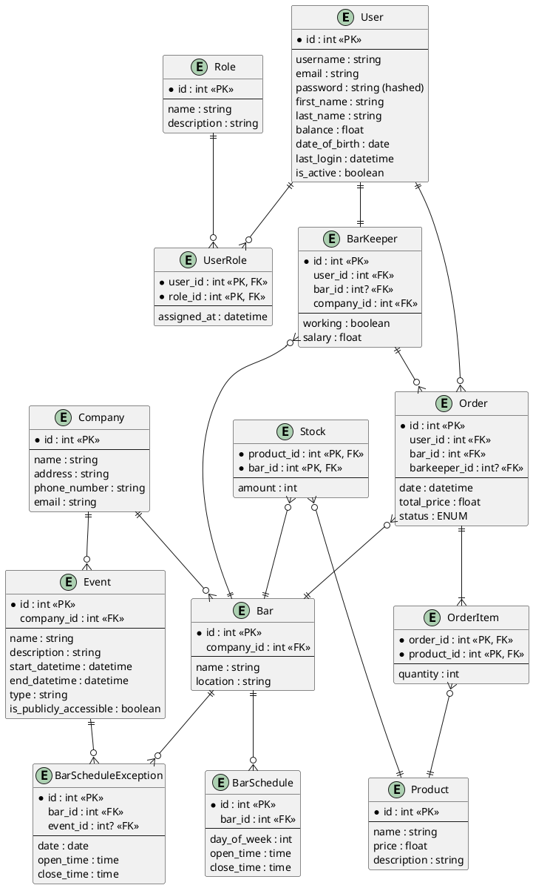

```plantuml
@startuml

' Grouping user-related entities
entity User {
  * id : int <<PK>>
  --
  username : string
  email : string
  password : string (hashed)
  first_name : string
  last_name : string
  balance : float
  date_of_birth : date
  last_login : datetime
  is_active : boolean
}

entity Role {
  * id : int <<PK>>
  --
  name : string
  description : string
}

entity UserRole {
  * user_id : int <<PK, FK>>
  * role_id : int <<PK, FK>>
  --
  assigned_at : datetime
}

entity BarKeeper {
  * id : int <<PK>>
  user_id : int <<FK>>
  bar_id : int? <<FK>>
  company_id : int <<FK>>
  --
  working : boolean
  salary : float
}

' Grouping company and bar related entities
entity Company {
  * id : int <<PK>>
  --
  name : string
  address : string
  phone_number : string
  email : string
}

entity Bar {
	* id : int <<PK>>
	company_id : int <<FK>>
	--
	name : string
	location : string
}

' Default weekly schedule
entity BarSchedule {
	* id : int <<PK>>
	bar_id : int <<FK>>
	--
	day_of_week : int
	open_time : time
	close_time : time
}

' Exceptions to default schedule
entity BarScheduleException {
	* id : int <<PK>>
	bar_id : int <<FK>>
  event_id : int? <<FK>>
	--
	date : date
	open_time : time
	close_time : time
}

'Event can be like xmas party, or a closed event for a company
entity Event {
  * id : int <<PK>>
  company_id : int <<FK>>
  --
  name : string
  description : string
  start_datetime : datetime
  end_datetime : datetime
  type : string
  is_publicly_accessible : boolean
}

' Grouping order and product-related entities
entity Order {
  * id : int <<PK>>
  user_id : int <<FK>>
  bar_id : int <<FK>>
  barkeeper_id : int? <<FK>>
  --
  date : datetime
  total_price : float
  status : ENUM
}

entity OrderItem {
  * order_id : int <<PK, FK>>
  * product_id : int <<PK, FK>>
  --
  quantity : int
}

entity Product {
  * id : int <<PK>>
  --
  name : string
  price : float
  description : string
}

entity Stock {
  * product_id : int <<PK, FK>>
  * bar_id : int <<PK, FK>>
  --
  amount : int
}

' Relationship definitions (unchanged)
User ||--o{ Order
User ||--|| BarKeeper
Order ||--|{ OrderItem
OrderItem }o--|| Product
Stock }o--|| Bar
Order }o--|| Bar
Stock }o--|| Product
Bar ||--o{ BarKeeper
BarKeeper ||--o{ Order
Company ||--o{ Bar
User ||--o{ UserRole
Role ||--o{ UserRole
Bar ||--o{ BarSchedule
Bar ||--o{ BarScheduleException
Company ||--o{ Event
Event ||--o{ BarScheduleException
@enduml
```